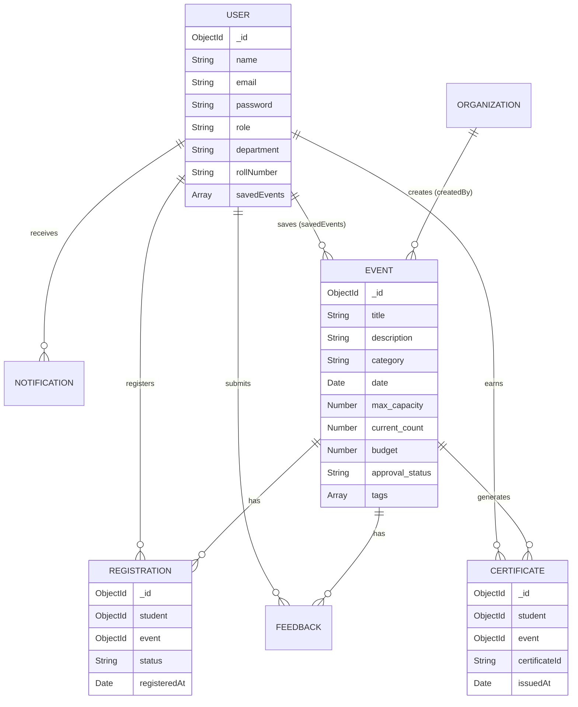
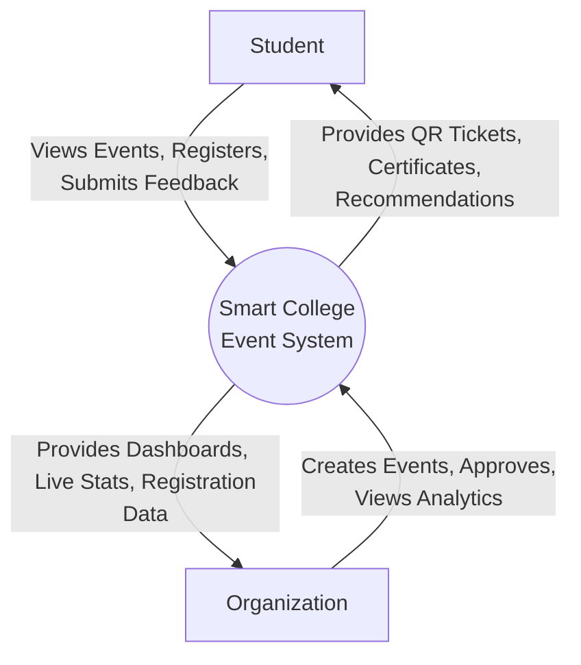

# System Design & Architecture

## 1. Entity-Relationship (ER) Diagram

## 2. Data Flow Diagram (Level 0 - Context Diagram)

## 3. Technology Stack Justification
- **MongoDB:** Chosen for its flexible, document-based schema, allowing for rapid iteration of the Event and User models. The atomic `$inc` operator is crucial for managing concurrent registrations and preventing race conditions.
- **Express.js & Node.js:** Provides a lightweight, high-performance asynchronous backend capable of handling multiple concurrent requests, particularly useful during high-traffic registration periods.
- **React.js:** Facilitates the creation of a dynamic, single-page application (SPA). The component-based architecture ensures code reusability.
- **Zustand:** Selected over Redux for state management due to its minimal boilerplate, providing a clean and efficient way to manage global state (e.g., authentication, events).
- **Framer Motion & Recharts:** Utilized to achieve the premium SaaS aesthetic, providing fluid animations and interactive data visualizations that elevate the user experience beyond standard academic projects.
